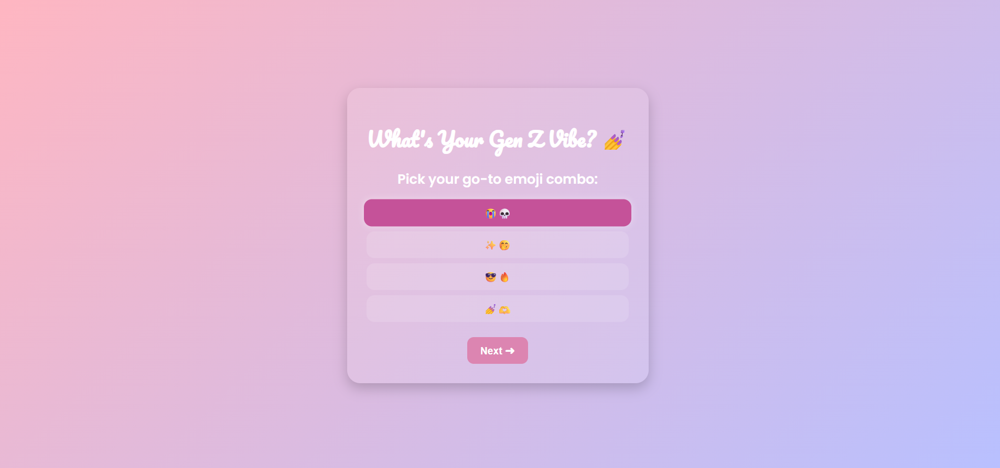

#  Vibe Quiz — What's Your Gen Z Energy? 

A fun, pastel-themed personality quiz built with **HTML**, **CSS**, and **JavaScript** that tells you your Gen Z “vibe” — whether you’re a ✨Main Character✨, a Chill Minimalist, or that Meme Philosopher who texts “💀😭” unironically.




---

##  Live Demo
 [Try it here!](https://tanushree-rd.github.io/vibe-quiz/)

---

## 🧩 Features
- 5 chaotic Gen Z-themed questions  
- Aesthetic pastel gradient background  
- Cute handwriting fonts (Poppins + Pacifico)  
- Highlighted selections with smooth interactivity  
- Share your result on **Twitter**, **WhatsApp**, or **Instagram**

---

## 🛠️ Tech Stack
- **HTML5** — structure  
- **CSS3** — pastel gradients + styling  
- **Vanilla JS** — quiz logic + result sharing  
- **GitHub Pages** — hosting  

---


At the end, the script counts which vibe you chose most often and gives you your personality type.

---

## Setup Locally
If you want to edit or remix it:
```bash
git clone https://github.com/Tanushree-RD/vibe-quiz.git
cd vibe-quiz
# then open index.html in your browser
